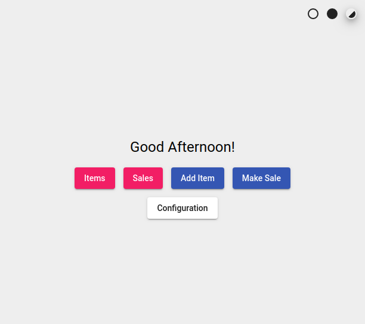
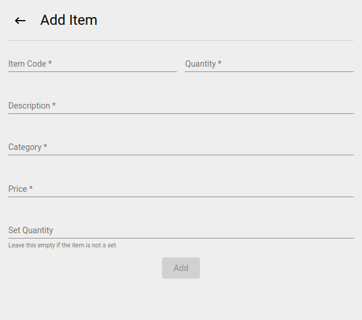
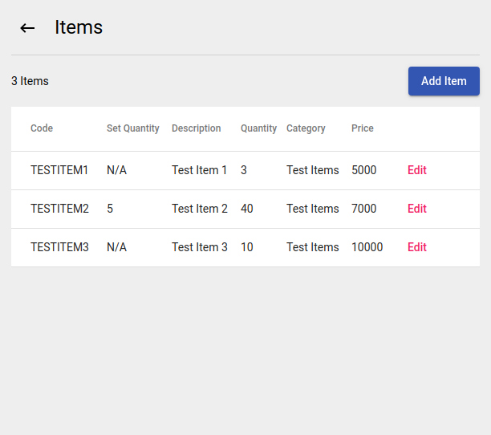
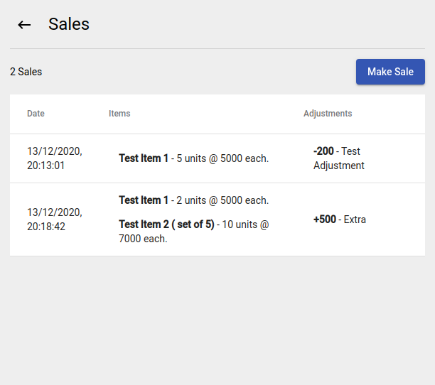
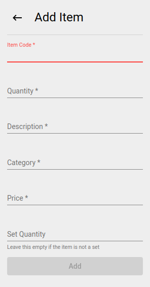
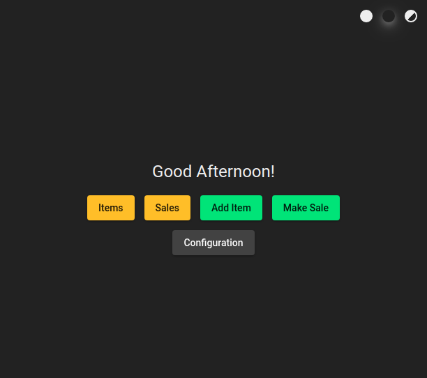

# TinyStock
Minimal stock keeping App built with Electron, Node.js and Angular.

## Features

- Password based AES-256 encryption
- Save data locally or over the Web
- Responsive UI
- Dark theme

## Screenshots

### Main Screen

### Add Item

### Items

### Sales

### Responsive UI

### Dark Theme

### Example of Encrypted Data

## Development
This is a standard client-server Web app packaged in an Electron container.

Although they are meant to be packaged together, the backend and frontend can run independently and often do during development. As such, the client and server contain code for both Web based and Electron IPC based communication, and the method to use is decided at runtime.

All below commands are run from the root directory.

### Directory Structure
- The `models` directory contains a `models.ts` file shared between the backend and frontend. It is treated as a separate npm module that is build then installed in the front/back-ends. All build artifacts are stored here too.
- The `backend` directory contains all backend code. Build artifacts are stored in `backend/dist`.
- The `frontend` directory contains all frontend code. Build artifacts are stored in `frontend-dist`.

### Building
Each module must be built before it can run. They must be built in this order:
1. Build `models` module: `npm run models-build`.
2. Build `backend` module: `npm run back-build`.
3. Build `frontend` module: `npm run front-build`.

### Running in Development
When developing, the modules can be set to run continuously and automatically recompile when relevant files change.
1. Continuously build the `models` module: `npm run models-dev`.
2. Continously run the `backend` module without building: `npm run back-dev`.
3. Continuously run the `frontend` module without building: `npm run front-dev`.
Note that the frontend cannot run (well) if the backend is not already running, and neither will work if the models have not been compiled.

### Electron
Once all modules have been built, the application can be run in an electron container using `npm run app`.

The electron app can be compiled using `npm run app-build-linux`, `npm run app-build-windows`, or `npm run app-build-mac` for Linux, Windows, or MacOS respectively. Build artifacts are stored in the `build` directory.

## TODO
- An 'Add Purchase' (and a 'Purchases') page where purchases are recorded (multiple items at once) and item quantities are increased from there (similar to how sales decrease item quantities)
- Once the 'Add Purchase' page is implemented, remove the possibility of changing quantities manually - this ensures that sale and purchase history can be used to get an accurate measure of item quantity for any given date/time.
- For the 'Add Sale' (and 'Add Item') page, make sure that an attempt to add an item already in list is not rejected; instead, the new data should be merged with existing data.
- Add commas in numbers for readability ('2000 and 20000' is harder to read than '2,000 and 20,000').
- On the 'Add Sale' and 'Add Purchase' pages, the item code input should have a dropdown with all existing item codes.
- On the 'Add Sale' and 'Add Purchase' pages, items should be searchable by description as an alternative to the code input.
- Add a 'Report' screen with various settings that can be tuned to generate specific reports. This page would replace the existing 'Sales' (and 'Purchases') screen(s). The report would, by default, show all sales and purchases for all items for all time. It could be tuned to only show data within a specific date range, or to only show either sales or purchases, or to only show data for a specific item (in which case it would show more detail such as the opening quantity of the item and the new quantity after each sale/purchase).