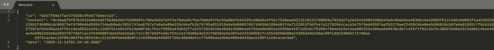

# TinyStock
Minimal stock keeping App built with Electron, Node.js and Angular.

## Features

- Password based AES-256 encryption
- Save data locally or over the Web
- Responsive UI
- Dark theme

## Screenshots
> These are slightly out of date
### Main Screen

### Add Item

### Items

### Sales

### Responsive UI

### Dark Theme

### Example of Encrypted Data

## Development
This is a standard client-server Web app packaged in an Electron container.

Although they are meant to be packaged together, the backend and frontend can run independently and often do during development. As such, the client and server contain code for both Web based and Electron IPC based communication, and the method to use is decided at runtime.

All below commands are run from the root directory.

### Directory Structure
- The `models` directory contains a `models.ts` file shared between the backend and frontend. It is treated as a separate npm module that is build then installed in the front/back-ends. All build artifacts are stored here too.
- The `backend` directory contains all backend code. Build artifacts are stored in `backend/dist`.
- The `frontend` directory contains all frontend code. Build artifacts are stored in `frontend-dist`.

### Building
Each module must be built before it can run. They must be built in this order:
1. Build `models` module: `npm run models-build`.
2. Build `backend` module: `npm run back-build`.
3. Build `frontend` module: `npm run front-build`.

### Running in Development
When developing, the modules can be set to run continuously and automatically recompile when relevant files change.
1. Continuously build the `models` module: `npm run models-dev`.
2. Continously run the `backend` module without building: `npm run back-dev`.
3. Continuously run the `frontend` module without building: `npm run front-dev`.
Note that the frontend cannot run (well) if the backend is not already running, and neither will work if the models have not been compiled.

### Electron
Once all modules have been built, the application can be run in an electron container using `npm run app`.

The electron app can be compiled using `npm run app-build-linux`, `npm run app-build-windows`, or `npm run app-build-mac` for Linux, Windows, or MacOS respectively. Build artifacts are stored in the `build` directory.

## TODO
- Test the App with thousands of items/sales/purchases to make sure performance scales well. If not, some changes could be made:
    - Switch to a regular SQL DB instead of relying on files. Files are portable and allow the App to be self-contained without having to rely on an external database, but using them may not scale well. This needs to be tested.
    - Improve search speed, perhaps using hashes or other data structures.
- Replace the existing Sales and Purchases pages with a single 'Report' page that would show all sales and purchases on one table. The table should feature a couple of check boxes for 'Show Sales Only'/'Show Purchases Only', a date picker or two to filter for transactions from a certain timeframe, and a search box to filter transactions based on item or adjustment details. The total transaction amounts for the chosen timeframe would be shown. A modified version of the Item Search component would also be there to allow for filtering based on item. When item filtering is done, the opening and closing quantities for the item are shown.
